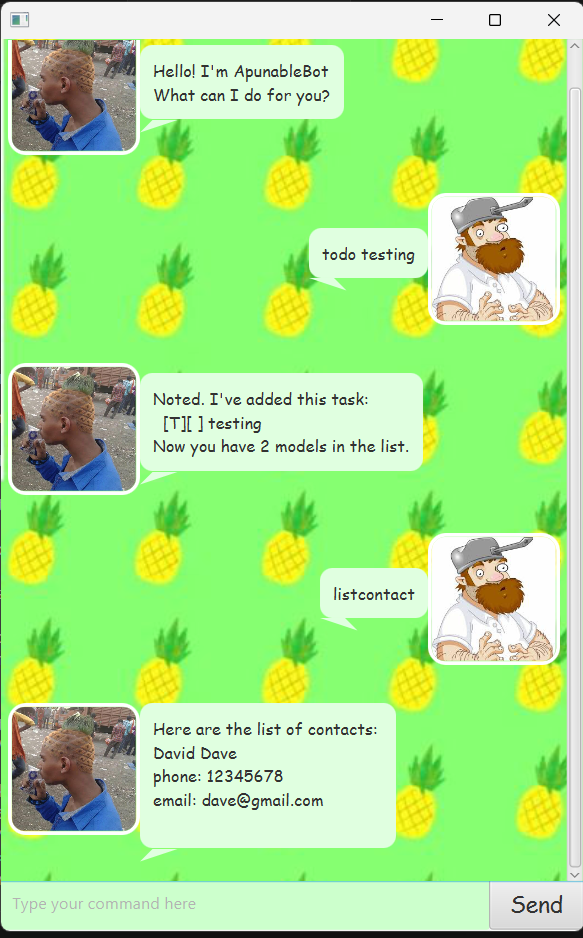

# ApunableBot User Guide

## Quick Start
1. Ensure you have Java `17` or above installed in your Computer.  
**Mac users**: Ensure you have the precise JDK version prescribed [here](https://se-education.org/guides/tutorials/javaInstallationMac.html).
1. Download the latest .`jar` file from [here](https://github.com/TeeJinSeng/ip/releases). 
1. Copy the file to the folder you want to use as the _home folder_ for your AddressBook.
1. Open a command terminal, `cd` into the folder you put the jar file in, and use the `java -jar apunable-<version>.jar` command to run the application.  
A GUI of the chatbot similar to the above will appear here. 
1. Type the command in the command box and press Enter/click on `Send` button to execute it.  
Some example commands you can try: 
    - `list` - Lists all tasks
    - `todo testing` - Adds a todo task.
    - `delete 1` - Delete the first task in the list. 
    - `listcontact` - Lists all contacts. 
    - `addcontact Apunable /email apunable@gmail.com` - Adds a contact named `Apunable` into contact list.
    - `deletecontact Apunable` - Deletes the contact named `Apunable` from the contacts. 
1. Refer to the [Features](#features) below for details of each command.

## Accepted formats for datetime

Some of the commands will involve datetime, and below are the accepted format for those fields. 

- date: `dd-MM-yyyy`, `dd/MM/yyyy`, `yyyy-MM-dd`, `yyyy/MM/dd`
- time: `HHmm`, `HH:mm`
- datetime: \<date\> \<time\>(separated by space)

## Features

## Adding deadlines: `deadline`

Adds a task with deadline to the task list.

Format: `deadline <description> /by <datetime>`

Example: `deadline finish trying out this chatbot /by 26-10-2025`

## Adding todos: `todo`

Adds a todo task to the task list

Format: `todo <description>`

Example: `todo test this chatbot`

## Adding events: `event`

Adds a event task to the task list

Format: `event <description> /from <datetime> /to <datetime>`

Example: `event wellbeing day /from 21-10-2025 00:00 /to 21/10/25 2359`

## Mark/unmark tasks: `mark`/`unmark`

Mark a task as done/undone

Format: `mark/unmark <index>`

Example: 
- `mark 1` Marks the 1st task in the list to be done.
- `unmark 1` Marks it back to be undone.

## Listing all tasks: `list`

Shows a list of all tasks in the task list.

Format: `list`

## Deleting a tasks: `delete`

Removes a task from the list.

Format: `delete <index>`

Example: `delete 1` Removes the first task in the list.

## : Finding tasks occuring at specific date time: `check-occur`

Shows a list of tasks occuring at provided date time in the task list.

Format: `check-occur <datetime>`

Example: `check-occur 2025-08-31 00:00` Shows all the deadlines which the `/by` is occuring at or after the provided time and all the events where the provided date time is withing `/from` and `/to`

## Finding tasks matching certain description: `find`

Shows a list of tasks whose description contains the keyword

Example: 
- `find test` Shows a list of tasks whose description contains the keyword `test`.

## Adding contacts: `addcontact`

Adds a contact to the contact list. 

Format: `addcontact <name> [/firstname <firstname>] [/lastname <lastname>] /email <email> /phone <phone> /address <address> [/org <organization>] [/notes <notes>] [/nickname <nickname>] [/birthday <birthday>]`

Example: `addcontact Crazy Dave /email dave@gmail.com` Adds a new contact named `Crazy Dave`. At least one among `email`, `phone`, `address` but be provided to add a new contact. The name must also be unique. 

## Deleting contacts: `deletecontact`

Removes a contact from the contact list. 

Format: `deletecontact <name>`

Example: `deletecontact Crazy Dave` Removes a contact named `Crazy Dave`. 

## Listing contacts or full details: `listcontact`

Shows a list of all contacts or show details of a contact. 

Format: 
- `listcontact`
- `listcontact <name>`
- `listcontact <name> /a`

Example: 
- `listcontact` Shows all contacts in the list. 
- `listcontact Crazy Dave` Shows the details of `Crazy Dave`
- `listcontact Crazy Dave \a` Shows the full details of `Crazy Dave`

## Editing a contact: `editcontact`

Edits an existing contact in the list. 

Format: `editcontact <name> [/firstname <firstname>] [/lastname <lastname>] [/email <email>] [/phone <phone>] [/address <address>] [/org <organization>] [/notes <notes>] [/nickname <nickname>] [/birthday <birthday>]`

Example: `editcontact Crazy Dave /notes Apunable's client` Edits an existing contact named `Crazy Dave`, set the notes to the one provided.

## Filter out contacts with certain criteria: `filtercontact`

Shows a list of contacts fulfilling certain criteria. 

Format: `filtercontact [/name <name>] [/firstname <firstname>] [/lastname <lastname>] [/email <email>] [/phone <phone>] [/address <address>] [/org <organization>] [/notes <notes>] [/nickname <nickname>] [/birthday <birthday>]`

Example: 
- `filtercontact /name Crazy Dave` Shows the person with name `Crazy Dave`. 
- `filtercontact /org Pineapple Gang` Shows the persons in `Pineapple Gang`
- `filtercontact /firstname Dave /birthday 28-02-2025` Shows the persons with firstname `Dave` and gave birth on `28-02-2025`. 

## Exiting the program: `bye`

Exits the program.

Format: `bye`

## Saving the data
Task list data are saved in the hard disk automatically after exiting the program, while contacts data are saved automatically after any command that changes the data. There is no need to save manually.

## Editing the data file
datas are saved in `tasks.txt` and `contacts.txt` with specific format. Users who have learnt what is the format are welcome to update data directly by editing that data file

> [!CAUTION]
> This is a caution. It advises about potential negative consequences of an action.